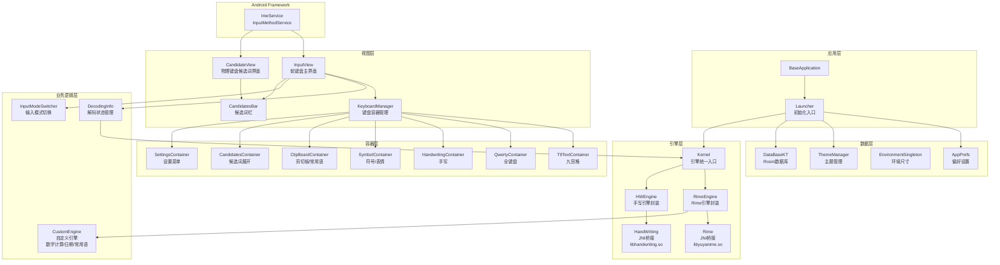
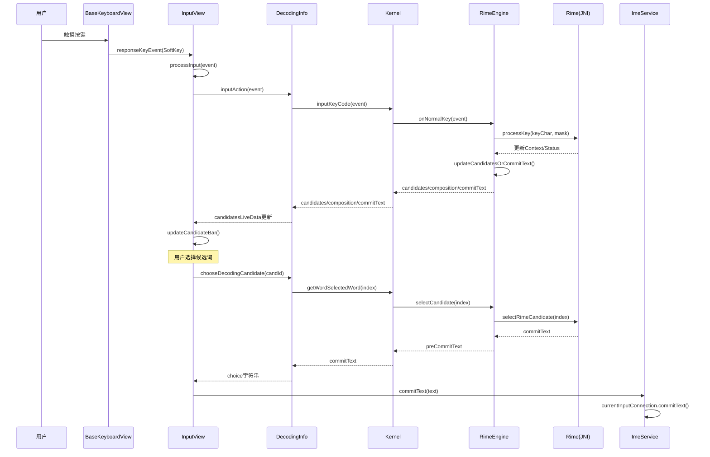
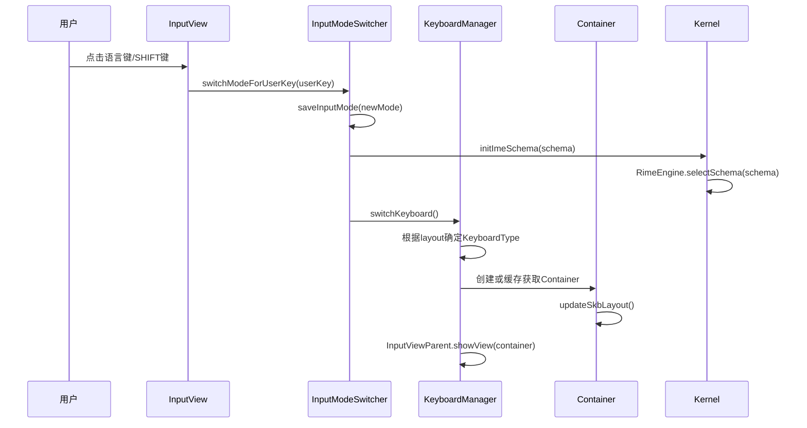
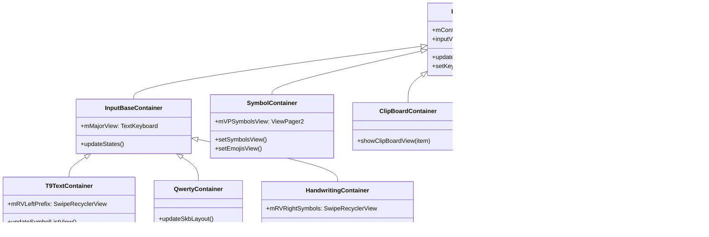
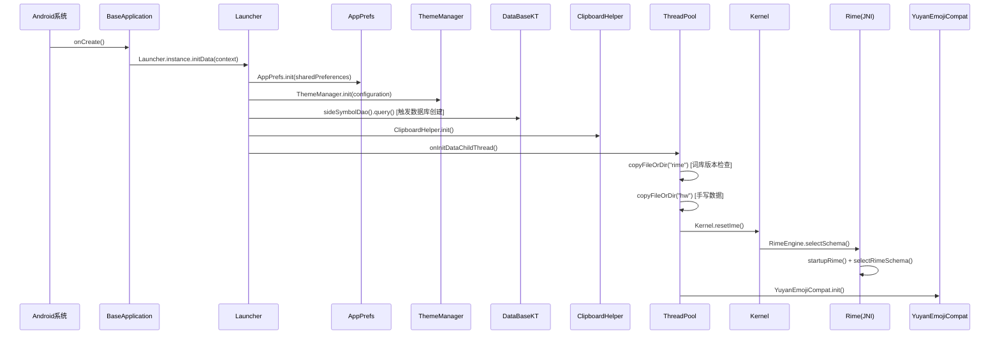

# 语燕输入法 (YuyanIme) 项目架构文档

> 本文档基于代码深度分析生成，用于指导后续深入修改。

## 1. 项目概览

语燕输入法是一款基于 Rime 引擎的 Android 拼音输入法，采用 Kotlin 开发，核心特点：
- 基于 Rime 引擎（通过 JNI 调用 `libyuyanime.so`）
- 支持九宫格/全键/双拼/乱序17/手写/五笔画等多种输入方案
- 纯离线、最小权限、无广告
- 支持深色主题、悬浮键盘、单手模式、花漾字等个性化功能

## 2. 项目结构

```
YuyanIme/
├── app/                          # 应用壳模块（薄层）
│   └── src/main/
│       ├── java/com/yuyan/
│       │   └── BaseApplication.kt # Application入口
│       ├── res/xml/method.xml    # 输入法Service声明
│       └── AndroidManifest.xml   # 清单文件
├── yuyansdk/                     # 核心SDK模块（git子模块）
│   ├── libs/                     # SO库
│   │   ├── arm64-v8a/
│   │   │   ├── libyuyanime.so    # Rime引擎JNI桥接
│   │   │   ├── libhandwriting.so # 手写识别引擎
│   │   │   ├── libhwInterface.so # 手写接口层
│   │   │   ├── libgpen_handwriter.so # 手写笔迹渲染
│   │   │   └── libSogouShell.so  # 搜狗手写识别
│   │   ├── armeabi-v7a/libyuyanime.so
│   │   ├── x86/libyuyanime.so
│   │   └── x86_64/libyuyanime.so
│   └── src/main/
│       ├── assets/
│       │   ├── hw/               # 手写识别模型数据
│       │   ├── pinyindb/         # 拼音数据库
│       │   └── rime/             # Rime词库与方案配置
│       │       ├── build/        # 编译后的Rime方案（.bin/.yaml）
│       │       └── opencc/       # 开放中文转换（简繁、Emoji等）
│       ├── java/com/yuyan/
│       │   ├── inputmethod/      # 输入法引擎层
│       │   └── imemodule/        # IME模块层
│       └── res/                  # 资源文件
├── build.gradle                  # 根构建配置
├── settings.gradle               # 模块声明: ':yuyansdk', ':app'
└── gradle.properties             # Gradle属性
```

## 3. 构建配置

| 配置项 | 值 |
|--------|-----|
| compileSdk | 36 |
| minSdk | 23 |
| targetSdk | 36 (app) / 35 (sdk) |
| JDK | 17 |
| Kotlin | 2.0.0 |
| Gradle Plugin | 8.3.2 |
| KSP | 2.0.0-1.0.23 |
| ABI | arm64-v8a (app默认) / 全架构 (sdk) |

### 关键依赖

| 库 | 用途 |
|----|------|
| Room 2.6.1 | 本地数据库（剪切板、常用语、符号、菜单） |
| Flexbox 3.0.0 | 候选词/符号流式布局 |
| Emoji2 1.5.0 | Emoji兼容 |
| Navigation 2.8.5 | 设置页面导航 |
| Splitties 3.0.0 | DSL视图构建 |
| kotlinx-serialization 1.6.2 | JSON序列化 |
| kotlinx-coroutines 1.9.0 | 协程 |

### 构建变体

- **debug**: applicationIdSuffix=".debug"
- **release**: 混淆开启, applicationIdSuffix=".release"
- **offline**: 使用本地SO库（jniLibs.srcDirs = ['libs']）

## 4. 核心架构

### 4.1 整体架构图



### 4.2 数据流：按键输入到上屏



### 4.3 键盘切换流程



## 5. 核心模块详解

### 5.1 引擎层 (`com.yuyan.inputmethod`)

#### Kernel（引擎统一入口）
- **文件**: [Kernel.kt](file:///e:/ProjCenter/YuyanIme/yuyansdk/src/main/java/com/yuyan/inputmethod/core/Kernel.kt)
- **职责**: 对 RimeEngine 的薄封装，提供输入法核心操作的统一接口
- **关键方法**:
  - `initImeSchema(schema)` - 初始化/切换Rime方案
  - `inputKeyCode(event)` - 传入按键事件
  - `getWordSelectedWord(index)` - 选择候选词
  - `deleteAction()` - 删除操作
  - `getAssociateWord(words)` - 联想词查询
  - `nativeUpdateImeOption()` - 刷新引擎配置（繁简、Emoji开关）

#### RimeEngine（Rime引擎封装）
- **文件**: [RimeEngine.kt](file:///e:/ProjCenter/YuyanIme/yuyansdk/src/main/java/com/yuyan/inputmethod/RimeEngine.kt)
- **职责**: 封装Rime JNI调用，管理按键记录栈、候选词、拼音组合
- **核心状态**:
  - `showCandidates: List<CandidateListItem>` - 当前候选词列表
  - `showComposition: String` - 拼音显示文本
  - `preCommitText: String` - 待提交文本
  - `keyRecordStack: KeyRecordStack` - 按键操作记录栈
- **关键逻辑**:
  - `onNormalKey(event)` - 处理按键输入，推送KeyRecordStack并调用Rime.processKey
  - `updateCandidatesOrCommitText()` - 核心方法，从Rime获取候选词/提交文本，处理大小写转换、拼音组合、自定义短语
  - `processDelAction()` - 通过KeyRecordStack回退操作，支持拼音→T9键回退
  - `selectPinyin(index)` - 选择拼音组合（九宫格/乱序17场景）
  - `predictAssociationWords(text)` - 联想词查询，合并Rime联想和CustomEngine联想

#### Rime（JNI桥接）
- **文件**: [Rime.kt](file:///e:/ProjCenter/YuyanIme/yuyansdk/src/main/java/com/yuyan/inputmethod/core/Rime.kt)
- **职责**: 直接映射JNI方法，加载 `libyuyanime.so`
- **关键JNI方法**:
  - `startupRime()` - 启动Rime引擎
  - `processRimeKey()` - 处理按键
  - `replaceRimeKey()` - 替换按键（拼音选择时用）
  - `selectRimeCandidate()` - 选择候选词
  - `getRimeContext()` - 获取上下文（候选词、拼音等）
  - `getRimeCommit()` - 获取提交文本
  - `selectRimeSchema()` - 切换方案
  - `setRimeOption()` - 设置选项
  - `getRimeAssociateList()` - 获取联想词

#### HandWriting（手写JNI桥接）
- **文件**: [HandWriting.kt](file:///e:/ProjCenter/YuyanIme/yuyansdk/src/main/java/com/yuyan/inputmethod/core/HandWriting.kt)
- **职责**: 加载 `libhandwriting.so`，提供手写识别JNI接口
- **关键方法**: `initWithDirectory()`, `inputHWPoints()`, `getCandidates()`, `reset()`

#### HWEngine（手写引擎封装）
- **文件**: [HWEngine.kt](file:///e:/ProjCenter/YuyanIme/yuyansdk/src/main/java/com/yuyan/inputmethod/HWEngine.kt)
- **职责**: 封装手写识别流程，将笔画数据传入HandWriting JNI，获取候选词并附加拼音注释

#### CustomEngine（自定义引擎）
- **文件**: [CustomEngine.kt](file:///e:/ProjCenter/YuyanIme/yuyansdk/src/main/java/com/yuyan/inputmethod/CustomEngine.kt)
- **职责**: 提供Rime之外的辅助功能
- **功能**:
  - `expressionCalculator()` - 数学表达式计算（基于ShuntingYard算法）
  - `processPhrase()` - 自定义常用语/日期时间快捷输入
  - `predictAssociationWordsChinese()` - 中文联想词（标点、日期）

#### KeyRecordStack（按键记录栈）
- **文件**: [KeyRecordStack.kt](file:///e:/ProjCenter/YuyanIme/yuyansdk/src/main/java/com/yuyan/inputmethod/data/KeyRecordStack.kt)
- **职责**: 记录用户按键操作，支持删除回退、拼音选择
- **InputKey类型**:
  - `T9Key` - 九宫格按键
  - `QwertKey` - 全键盘按键
  - `Apostrophe` - 分词符
  - `PinyinKey` - 拼音选择结果
  - `SelectPinyinAction` - 拼音选择操作标记
  - `DefaultAction` - 默认操作（候选词选择等）

### 5.2 数据结构 (`com.yuyan.inputmethod.core`)

| 数据类 | 用途 |
|--------|------|
| `SchemaItem` | Rime方案定义(id, name) |
| `CandidateListItem` | 候选词项(comment, text) |
| `RimeComposition` | 拼音组合(length, cursorPos, selStart, selEnd, preedit) |
| `RimeMenu` | 候选词菜单(pageSize, pageNo, isLastPage, candidates) |
| `RimeCommit` | 提交文本(commitText) |
| `RimeContext` | Rime上下文(composition, menu, commitTextPreview, selectLabels) |
| `RimeStatus` | Rime状态(schemaId, isComposing, isAsciiMode等) |

### 5.3 拼音工具 (`com.yuyan.inputmethod.util`)

| 工具类 | 职责 |
|--------|------|
| `T9PinYinUtils` | 九宫格T9键→拼音转换，拼音组合显示 |
| `QwertyPinYinUtils` | 全键拼音组合显示 |
| `DoublePinYinUtils` | 双拼键→拼音转换，双拼组合显示 |
| `LX17PinYinUtils` | 乱序17键→拼音转换 |
| `CommonUtils` | 通用拼音工具 |

### 5.4 服务层 (`com.yuyan.imemodule.service`)

#### ImeService（输入法服务）
- **文件**: [ImeService.kt](file:///e:/ProjCenter/YuyanIme/yuyansdk/src/main/java/com/yuyan/imemodule/service/ImeService.kt)
- **继承**: `InputMethodService`
- **职责**: Android输入法服务入口，管理软键盘/物理键盘输入
- **关键组件**:
  - `mInputView: InputView` - 软键盘视图
  - `mCandidateView: CandidateView` - 物理键盘候选词视图
- **关键方法**:
  - `onCreateInputView()` → 创建InputView
  - `onCreateCandidatesView()` → 创建CandidateView
  - `onKeyDown()/onKeyUp()` → 按键分发（区分物理/软键盘）
  - `commitText(text)` → 提交文本到编辑框（含花漾字转换）
  - `sendEnterKeyEvent()` → 模拟Enter键
  - `sendCombinationKeyEvents()` → 发送组合键
  - `onComputeInsets()` → 计算触摸区域（区分悬浮/普通模式）

#### DecodingInfo（解码状态管理）
- **文件**: [DecodingInfo.kt](file:///e:/ProjCenter/YuyanIme/yuyansdk/src/main/java/com/yuyan/imemodule/service/DecodingInfo.kt)
- **职责**: 管理候选词状态，作为Kernel与UI之间的桥梁
- **核心状态**:
  - `candidatesLiveData: MutableLiveData` - 候选词LiveData，驱动UI更新
  - `isAssociate: Boolean` - 是否联想模式
  - `activeCandidate: Int` - 当前候选词位置
- **关键方法**:
  - `inputAction(event)` → 输入按键
  - `deleteAction()` → 删除
  - `chooseDecodingCandidate(candId)` → 选择候选词
  - `nextPageCandidates` → 翻页加载更多
  - `getAssociateWord(words)` → 联想词查询

#### ClipboardHelper（剪切板监听）
- **文件**: [ClipboardHelper.kt](file:///e:/ProjCenter/YuyanIme/yuyansdk/src/main/java/com/yuyan/imemodule/service/ClipboardHelper.kt)
- **职责**: 监听系统剪切板变化，保存到数据库

### 5.5 键盘层 (`com.yuyan.imemodule.keyboard`)

#### InputView（软键盘主界面）
- **文件**: [InputView.kt](file:///e:/ProjCenter/YuyanIme/yuyansdk/src/main/java/com/yuyan/imemodule/keyboard/InputView.kt)
- **职责**: 软键盘根视图，协调候选词栏、键盘容器、弹出菜单
- **核心组件**:
  - `mSkbCandidatesBarView: CandidatesBar` - 候选词栏
  - `mSkbRoot: RelativeLayout` - 键盘根布局
  - `mAddPhrasesLayout: EditPhrasesView` - 常用语编辑
  - `mFullDisplayKeyboardBar` - 全面屏导航栏
- **关键方法**:
  - `responseKeyEvent(SoftKey)` → 处理按键事件
  - `responseLongKeyEvent(Pair)` → 处理长按事件
  - `processInput(event)` → 中文/英文输入处理
  - `chooseAndUpdate(candId)` → 选择候选词并更新
  - `onUpdateSelection()` → 光标变化时触发联想

#### KeyboardManager（键盘容器管理）
- **文件**: [KeyboardManager.kt](file:///e:/ProjCenter/YuyanIme/yuyansdk/src/main/java/com/yuyan/imemodule/keyboard/KeyboardManager.kt)
- **职责**: 管理键盘容器的创建、缓存、切换
- **KeyboardType枚举**:
  - T9, QWERTY, LX17, QWERTYABC, NUMBER, SYMBOL, SETTINGS, HANDWRITING, CANDIDATES, ClipBoard, TEXTEDIT
- **缓存策略**: `HashMap<KeyboardType, BaseContainer?>` 缓存已创建的容器

#### BaseKeyboardView（键盘根视图）
- **文件**: [BaseKeyboardView.kt](file:///e:/ProjCenter/YuyanIme/yuyansdk/src/main/java/com/yuyan/imemodule/keyboard/BaseKeyboardView.kt)
- **职责**: 处理触摸事件、手势识别、长按弹出、重复按键
- **手势处理**:
  - 短按 → `responseKeyEvent()`
  - 长按 → 弹出PopupComponent（符号选择/功能菜单）
  - 上滑 → 输入小符号（keyLabelSmall）
  - 左右滑空格 → 移动光标
  - 左滑删除 → 清除输入
  - 长按删除滑动 → 撤销删除

#### TextKeyboard（软键盘绘制）
- **文件**: [TextKeyboard.kt](file:///e:/ProjCenter/YuyanIme/yuyansdk/src/main/java/com/yuyan/imemodule/keyboard/TextKeyboard.kt)
- **职责**: 键盘Canvas绘制，支持主题、按键边框、圆角、助记符
- **绘制层次**: 按键背景 → 小符号 → 图标/文字 → 助记符

#### HandwritingKeyboard（手写键盘）
- **文件**: [HandwritingKeyboard.kt](file:///e:/ProjCenter/YuyanIme/yuyansdk/src/main/java/com/yuyan/imemodule/keyboard/HandwritingKeyboard.kt)
- **继承**: TextKeyboard
- **职责**: 在键盘上绘制手写笔迹，收集笔画数据，定时识别
- **识别流程**: 收集笔画点 → 超时/抬手 → HWEngine.recognitionData() → 回调候选词

#### KeyboardData（键盘布局数据）
- **文件**: [KeyboardData.kt](file:///e:/ProjCenter/YuyanIme/yuyansdk/src/main/java/com/yuyan/imemodule/keyboard/KeyboardData.kt)
- **职责**: 定义各键盘布局的按键KeyCode矩阵
- **布局**: 每种布局支持3种风格（Google/Samsung/Yuyan）

### 5.6 容器层 (`com.yuyan.imemodule.keyboard.container`)



| 容器 | 布局 | 特点 |
|------|------|------|
| T9TextContainer | 九宫格+左侧符号/拼音栏 | 左侧有拼音选择/符号列表 |
| QwertyContainer | 全键盘 | 无侧栏，纯键盘 |
| HandwritingContainer | 手写+右侧符号栏 | 右侧符号列表 |
| SymbolContainer | 符号/表情 | ViewPager2+TabLayout |
| ClipBoardContainer | 剪切板/常用语 | 支持List/Grid/Flexbox布局 |
| CandidatesContainer | 候选词展开 | FlexboxLayout+左侧拼音栏 |
| SettingsContainer | 设置菜单 | 键盘模式切换/菜单自定义 |

### 5.7 输入模式管理 (`InputModeSwitcher`)

- **文件**: [InputModeSwitcher.kt](file:///e:/ProjCenter/YuyanIme/yuyansdk/src/main/java/com/yuyan/imemodule/manager/InputModeSwitcher.kt)
- **模式编码**: 16位整数，高8位=键盘布局，低8位=语言+大小写
  - `MASK_SKB_LAYOUT = 0xff00` - 键盘布局掩码
  - `MASK_LANGUAGE = 0x00f0` - 语言掩码
  - `MASK_LANGUAGE_CN = 0x0010` - 中文
  - `MASK_LANGUAGE_EN = 0x0020` - 英文

| 布局常量 | 值 | 含义 |
|----------|-----|------|
| MASK_SKB_LAYOUT_QWERTY_PINYIN | 0x1000 | 全键拼音 |
| MASK_SKB_LAYOUT_T9_PINYIN | 0x2000 | 九宫格拼音 |
| MASK_SKB_LAYOUT_HANDWRITING | 0x3000 | 手写 |
| MASK_SKB_LAYOUT_QWERTY_ABC | 0x4000 | 全键英文 |
| MASK_SKB_LAYOUT_NUMBER | 0x5000 | 数字 |
| MASK_SKB_LAYOUT_LX17 | 0x6000 | 乱序17 |
| MASK_SKB_LAYOUT_STROKE | 0x7000 | 五笔画 |
| MASK_SKB_LAYOUT_TEXTEDIT | 0x8000 | 文本编辑 |

**用户自定义按键码**:

| 常量 | 值 | 含义 |
|------|-----|------|
| USER_KEYCODE_LANG | -2 | 语言切换 |
| USER_KEYCODE_SYMBOL | -3 | 符号键盘 |
| USER_KEYCODE_EMOJI | -4 | 表情键盘 |
| USER_KEYCODE_RETURN | -6 | 返回语言键盘 |
| USER_KEYCODE_TEXTEDIT | -7 | 编辑键盘 |
| USER_KEYCODE_CURSOR_DIRECTION | -9 | 方向控制 |
| USER_KEYCODE_LEFT_SYMBOL | -12 | 侧边符号栏占位 |
| USER_KEYCODE_SELECT_MODE | -18 | 选择模式 |
| USER_KEYCODE_SELECT_ALL | -19 | 全选 |
| USER_KEYCODE_CUT/COPY/PASTE | -20/-21/-22 | 剪切/复制/粘贴 |
| USER_KEYCODE_MOVE_START/END | -23/-24 | 移动到开头/结尾 |

### 5.8 Rime方案配置

| 方案ID | 常量 | 类型 |
|--------|------|------|
| t9_pinyin | SCHEMA_ZH_T9 | 九宫格拼音 |
| pinyin | SCHEMA_ZH_QWERTY | 全键拼音 |
| english | SCHEMA_EN | 英文 |
| double_pinyin_flypy | SCHEMA_ZH_DOUBLE_FLYPY+"flypy" | 小鹤双拼 |
| double_pinyin_ls17 | SCHEMA_ZH_DOUBLE_LX17 | 乱序17 |
| double_pinyin_abc/natural/mspy/sogou/ziguang | SCHEMA_ZH_DOUBLE_FLYPY+后缀 | 其他双拼 |
| stroke | SCHEMA_ZH_STROKE | 五笔画 |

### 5.9 数据层

#### AppPrefs（偏好设置）
- **文件**: [AppPrefs.kt](file:///e:/ProjCenter/YuyanIme/yuyansdk/src/main/java/com/yuyan/imemodule/prefs/AppPrefs.kt)
- **基于**: `SharedPreferences` + 自定义 `ManagedPreference` 框架
- **分类**:

| 分类 | 关键配置 |
|------|----------|
| Internal | pinyinModeRime, inputDefaultMode, keyboardHeightRatio, keyboardModeFloat, clipboardUpdateContent, fullDisplayKeyboardEnable |
| Input | chineseFanTi, doublePYSchemaMode, chinesePrediction, abcSearchEnglishCell, emojiInput, symbolPairInput |
| KeyboardSetting | candidateTextSize, longPressTimeout, abcNumberLine, oneHandedMod, spaceSwipeMoveCursor, keyboardMnemonic |
| Handwriting | handWritingWidth, handWritingSpeed |
| Clipboard | clipboardListening, clipboardHistoryLimit, clipboardSuggestion, clipboardLayoutCompact |
| Other | imeHideIcon |

#### DataBaseKT（Room数据库）
- **文件**: [DataBaseKT.kt](file:///e:/ProjCenter/YuyanIme/yuyansdk/src/main/java/com/yuyan/imemodule/database/DataBaseKT.kt)
- **版本**: 4
- **表**:

| 表 | Entity | DAO | 用途 |
|----|--------|-----|------|
| side_symbol | SideSymbol | SideSymbolDao | 侧边符号（拼音/数字） |
| clipboard | Clipboard | ClipboardDao | 剪切板历史 |
| used_symbol | UsedSymbol | UsedSymbolDao | 最近使用符号 |
| phrase | Phrase | PhraseDao | 自定义常用语 |
| skbfun | SkbFun | SkbFunDao | 键盘菜单配置 |

#### EnvironmentSingleton（环境尺寸）
- **文件**: [EnvironmentSingleton.kt](file:///e:/ProjCenter/YuyanIme/yuyansdk/src/main/java/com/yuyan/imemodule/singleton/EnvironmentSingleton.kt)
- **职责**: 计算并缓存所有布局尺寸（屏幕、键盘、候选词、按键等）
- **关键尺寸**: mScreenWidth, mScreenHeight, skbWidth, skbHeight, inputAreaHeight, heightForCandidatesArea, keyTextSize, keyXMargin, keyYMargin

### 5.10 主题系统 (`com.yuyan.imemodule.data.theme`)

| 类 | 职责 |
|----|------|
| ThemeManager | 主题管理器，管理主题切换、深色模式、主题偏好 |
| Theme | 主题数据类，定义颜色、背景、按键样式 |
| ThemePreset | 预设主题 |
| ThemePrefs | 主题偏好设置 |
| ThemeFilesManager | 主题文件管理 |
| CustomThemeSerializer | 自定义主题序列化 |

### 5.11 候选词系统

| 组件 | 用途 |
|------|------|
| CandidatesBar | 软键盘顶部候选词栏（拼音+候选词横向滚动） |
| FloatCandidateBar | 物理键盘浮动候选词栏 |
| CandidateView | 物理键盘候选词视图容器 |
| CandidatesAdapter | 候选词展开视图适配器 |
| CandidatesBarAdapter | 候选词栏适配器 |
| CandidatesMenuAdapter | 候选词菜单适配器 |

### 5.12 设置界面 (`com.yuyan.imemodule.ui`)

| Fragment | 设置项 |
|----------|--------|
| ImeSettingsFragment | 输入法总设置 |
| InputSettingsFragment | 输入设置（繁简、双拼、联想、Emoji） |
| KeyboardSettingFragment | 键盘设置（字号、长按、数字行、单手） |
| KeyboardFeedbacksFragment | 按键反馈（音量、振动） |
| FullDisplayKeyboardFragment | 全面屏键盘优化 |
| ClipboardSettingsFragment | 剪切板设置 |
| HandwritingSettingsFragment | 手写设置 |
| VoiceSettingsFragment | 语音设置 |
| PrefixSettingsFragment | 侧边符号设置 |
| SidebarSymbolFragment | 侧边符号管理 |
| ThemeFragment/ThemeSettingsFragment | 主题设置 |
| OtherSettingsFragment | 其他设置 |
| AboutFragment | 关于 |
| PrivacyPolicyFragment | 隐私政策 |

### 5.13 弹出组件 (`com.yuyan.imemodule.view.popup`)

| 组件 | 用途 |
|------|------|
| PopupComponent | 弹出菜单管理器（符号选择、功能菜单） |
| PopupKeyboardUi | 符号选择弹出键盘 |
| PopupKeyboardMenuUi | 功能菜单弹出 |
| PopupContainerUi | 弹出容器 |
| PopupPreset | 弹出预设配置 |

### 5.14 花漾字系统 (`com.yuyan.imemodule.data.flower`)

| 模式 | 效果 |
|------|------|
| Mars | 火星文（焱暒妏） |
| Flower | 花藤字 |
| Messy | 凌乱字 |
| Sprout | 发芽字 |
| Haze | 雾霾字 |
| BanView | 禁止查看 |
| Grass | 长草字 |
| Wind | 起风了 |

## 6. 初始化流程



## 7. Rime词库与方案

### 词库路径
- **内置**: `assets/rime/build/` - 编译后的方案和词库
- **运行时**: `context.getExternalFilesDir("rime")` - 用户数据目录

### 方案文件
| 文件 | 用途 |
|------|------|
| t9_pinyin.schema.yaml / .prism.bin | 九宫格拼音方案 |
| pinyin.schema.yaml / .prism.bin / .table.bin | 全键拼音方案 |
| double_pinyin_*.schema.yaml / .prism.bin | 双拼方案（6种） |
| english.schema.yaml / .prism.bin / .table.bin | 英文方案 |
| stroke.schema.yaml / .prism.bin / .table.bin | 五笔画方案 |
| default.yaml | Rime默认配置 |

### OpenCC配置
| 文件 | 用途 |
|------|------|
| s2t.json | 简体→繁体转换 |
| STCharacters.txt / STPhrases.txt | 繁体字/词映射 |
| emoji.json / emoji.txt | Emoji映射 |
| others.txt | 其他符号映射 |

## 8. 关键设计模式

### 8.1 单例模式
- `Launcher.instance` - 初始化入口
- `KeyboardManager.instance` - 键盘管理
- `EnvironmentSingleton.instance` - 环境尺寸
- `DataBaseKT.instance` - 数据库
- `AppPrefs.getInstance()` - 偏好设置
- `Rime.getInstance()` - Rime引擎
- `PopupComponent.get()` - 弹出组件

### 8.2 观察者模式
- `DecodingInfo.candidatesLiveData` → 驱动 `InputView` 和 `CandidateView` 更新候选词
- `ManagedPreference.OnChangeListener` → 偏好变更通知
- `ThemeManager.OnThemeChangeListener` → 主题变更通知
- `ClipboardHelper.OnPrimaryClipChangedListener` → 剪切板变更

### 8.3 容器/策略模式
- `KeyboardManager` 根据KeyboardType创建不同Container
- Container缓存复用，避免重复创建

### 8.4 操作栈模式
- `KeyRecordStack` 记录按键操作序列，支持精确回退

## 9. 修改指南

### 添加新输入方案
1. 在 `assets/rime/build/` 添加方案文件(.schema.yaml, .prism.bin, .table.bin)
2. 在 `CustomConstant` 添加方案常量
3. 在 `InputModeSwitcher` 添加布局掩码和模式常量
4. 在 `KeyboardData` 添加键盘布局数据
5. 在 `KeyboardManager.switchKeyboard(layout)` 添加布局映射
6. 在 `RimeEngine.updateCandidatesOrCommitText()` 的pinyins分支添加拼音转换逻辑
7. 在 `AppPrefs.Internal.pinyinModeRime` 添加默认值
8. 更新 `CURRENT_RIME_DICT_DATA_VERSIOM` 触发词库更新

### 添加新键盘容器
1. 继承 `BaseContainer` 或 `InputBaseContainer`
2. 在 `KeyboardManager.KeyboardType` 添加枚举值
3. 在 `KeyboardManager.switchKeyboard()` 添加创建逻辑
4. 在 `InputModeSwitcher` 添加模式常量（如需要）

### 添加新菜单功能
1. 在 `SkbMenuMode` 添加枚举值
2. 在 `SettingsMenuClick.onSettingsMenuClick()` 添加处理逻辑
3. 在 `DataBaseKT.initPhrasesDb()` 添加默认菜单项

### 修改候选词逻辑
1. 候选词获取: `RimeEngine.updateCandidatesOrCommitText()`
2. 候选词状态: `DecodingInfo`
3. 候选词显示: `CandidatesBar` / `FloatCandidateBar` / `CandidatesContainer`
4. 候选词选择: `InputView.chooseAndUpdate()` / `CandidateView.chooseAndUpdate()`

### 修改键盘绘制
1. 按键绘制: `TextKeyboard.drawSoftKey()`
2. 按键触摸: `BaseKeyboardView.onTouchEvent()`
3. 按键手势: `BaseKeyboardView.dispatchGestureEvent()`
4. 按键弹出: `PopupComponent`

## 10. 已知问题与注意事项

1. **横竖屏切换**: 切换时可能导致触摸无效，临时方案是确保输入框为空
2. **小米手机**: 需手动开启"后台弹出界面"权限
3. **三星手机**: 按键音量基于系统音量而非通知音量
4. **KeyRecordStack与Rime操作栈同步**: 删除回退时可能不一致，使用尝试不同长度替换的临时方案
5. **Rime pageSize**: 每次processKey前设置pageSize=100，确保获取足够候选词
6. **线程安全**: Rime JNI调用未做线程同步，需确保在主线程调用
7. **词库更新**: 通过 `CURRENT_RIME_DICT_DATA_VERSIOM` 版本号控制，升级时自动覆盖
